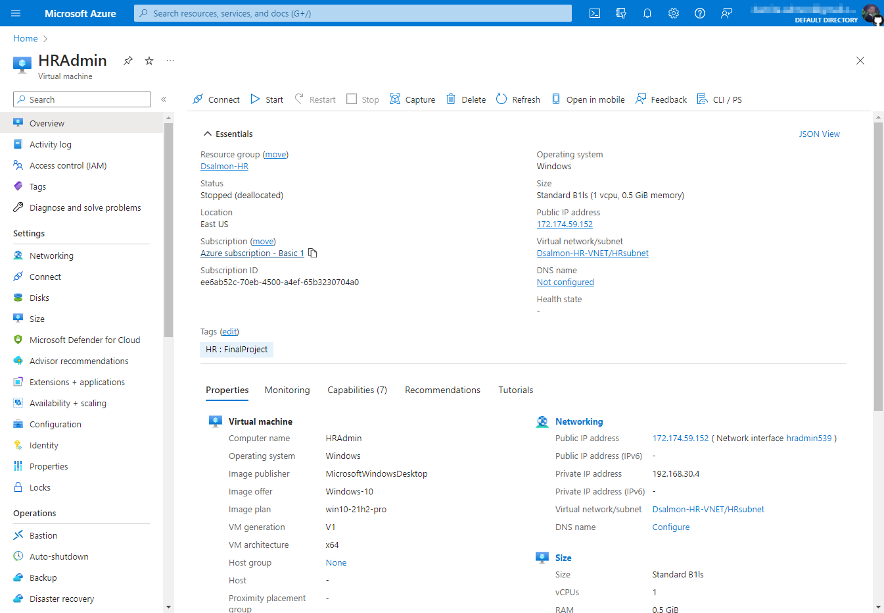

# AZFK-Tech Azure Cloud

## Background

I build this sample Azure infrastructure as a part of a skills-based assessment (SBA). This project was graded, so a many of the resources include my initials and/or last name to confirm it is my work. The alternative assignment was to present a business case convincing/explaining why the company should migrate to Azure.

**Note: You can click on the images to zoom-in.** 

## Scenario

**AZFK-Tech**, a newly founded business, has asked me, a contractor, to help them build up their cloud infrastructure. But before I can install the infrastructure in their production environment, I must first demonstrate my ability to do so in a virtual lab environment as a limited proof of concept according to their specifications. 

## Objectives

[Part 1: Set up Department Group Resources.](#Part 1)

[Part 2: Set up the VNets for each department.](#Part 2)

[Part 3: Set up VMs for each department.](#Part 3)

[Part 4: Create and Apply Security Group Policies to each department.](#Part 4)

[Part 5: Set up a Database.](#Part 5)

[Part 6: Set up a Web App for the Marketing and Sales (MAS) department.](#Part 6)

[Part 7: Deploy a shared storage between all departments.](#Part 7)

[Part 8: Deploy Monitoring resources.](#Part 8)

[Part 9: Questions.](#Part 9)

### <a name="Part 1">Part 1: Set up department group resources.</a>

**AZFK-Tech** needs to create a resource group for each department for their new cloud infrastructure. The details are below:

| **Department name** | **Resource Group Name** |
| --- | --- |
| Marketing and Sales (MAS) | First int + last name - MAS |
| IT | First int + last name - IT |
| HR | First int + last name - HR |

<figure markdown>
  { width="600" }
  <figcaption class="response" class="response">The created department resource groups.</figcaption class="response">
</figure>

### <a name="Part 2">Part 2: Set up VNets for each department.</a>

**AZFK-Tech** needs to create a VNet for each department for their new cloud infrastructure. The details are below:

| **Department name** | **VNET Name** | **IP Address** |
| --- | --- | --- |
| Marketing and Sales (MAS) | First int + last name - MAS-VNET | 192.168.10.0/24 |
| IT | First int + last name - IT-VNET | 192.168.20.0/24 |
| HR | First int + last name - HR-VNET | 192.168.30.0/24 |

<figure markdown>
  { width="600" }
  <figcaption class="response">The created VNet for each Department.</figcaption class="response">
</figure>

### <a name="Part 3">Part 3: Set up VMs for each department.</a>

**AZFK-Tech** needs to create a virtual machine (VM) for each department for their new cloud infrastructure. The details are below.

| **Department name** | **VMS Type** | **Computer Name** |
| --- | --- | --- |
| Marketing and Sales (MAS) | Windows OS | MasAdmin |
| IT | Windows Server OS | ITAdmin |
| HR | Windows OS | HRAdmin |

Created VMs for each department, displaying the network configuration and IP address information (property tab).

<figure markdown>
  { width="700" }
  <figcaption class="response">MAS Department VM.</figcaption class="response">
</figure>

<figure markdown>
  { width="700" }
  <figcaption class="response">IT Department VM.</figcaption class="response">
</figure>

<figure markdown>
  { width="700" }
  <figcaption class="response">HR Department VM.</figcaption class="response">
</figure>

### <a name="Part 4">Part 4: Create and Apply Security Group Policies to each department.</a>

**AZFK-Tech** needs to create a Security Group Policy for their new cloud infrastructure. The details are below.

<table>
  <tr style="font-weight:bold">
    <th>Department name</th>
    <th>Ports</th>
  </tr>
  <tr>
    <td>Marketing & Sales (MAS) & HR</td>
    <td>
	- Cannot ping any department  
	- Cannot remote to anyone  
	- Only use secure web connection</td>
  </tr>
  <tr>
    <td>IT</td>
    <td>- Can ping both MAS and HR  
	- Can remote to all  
	- Only use secure web connection</td>
  </tr>
</table>

**
Network Security Groups:
**

<figure markdown>
  { width="600" }
  <figcaption class="response">Applied Security Group Policies for each department.</figcaption class="response">
</figure>

**
Firewall Rules for each Department:
**

<figure markdown>
  { width="700" }
  <figcaption class="response">MAS NSG.</figcaption class="response">
</figure>

<figure markdown>
  { width="700" }
  <figcaption class="response">IT NSG.</figcaption class="response">
</figure>

<figure markdown>
  { width="700" }
  <figcaption class="response">HR NSG.</figcaption class="response">
</figure>

### <a name="Part 5">Part 5: Set up Database.</a>

**AZFK-Tech** needs to create a Database (DB) for each department.

- HR needs a database for employee documents and records.
- MAS needs to store its documents.
- IT needs a database to store device inventory.

| **Department name** | **Database Name** |
| --- | --- |
| Marketing and Sales (MAS) | First int + last name - mas-database |
| IT | First int + last name - it-database |
| HR | First int + last name - hr-database |

Database developers want to access the above listed department databases. They are using an IT VM to achieve this.

**Note: The DB software needs to be installed on the IT Virtual machine.**

**
The created database for each departments:
**

<figure markdown>
  { width="600" }
  <figcaption class="response">MAS Database (PostgreSQL)</figcaption class="response">
</figure>

<figure markdown>
  { width="600" }
  <figcaption class="response">IT Database (MySQL)</figcaption class="response">
</figure>

<figure markdown>
  { width="600" }
  <figcaption class="response">HR Database (PostgreSQL)</figcaption class="response">
</figure>

**
Successful access page to each database:
**

<figure markdown>
  { width="700" }
  <figcaption class="response">MAS DB Connection via IT VM</figcaption class="response">
</figure>

<figure markdown>
  { width="700" }
  <figcaption class="response">IT DB Connection via IT VM</figcaption class="response">
</figure>

<figure markdown>
  { width="700" }
  <figcaption class="response">HR DB Connection via IT VM</figcaption class="response">
</figure>

### <a name="Part 6">Part 6: Set up a Web App for the Marketing and Sales (MAS) Department.</a>

**AZFK-Tech** needs a Web App for the MAS Department. The web server homepage must show **"Welcome to AZFK-Tech World."**

| **Department name** | **Web Server Name** |
| --- | --- |
| Marketing and Sales (MAS) | First int + last name - MAS-WebServer |

<figure markdown>
  { width="700" }
  <figcaption class="response">Created Web Service.</figcaption class="response">
</figure>

<figure markdown>
  { width="700" }
  <figcaption class="response">Web Server home page showing, "Welcome to AZFK-Tech World."</figcaption class="response">
</figure>

### <a name="Part 7">Part 7: Deploy a shared storage between all departments.</a>

**AZFK-Tech** needs to create one shared storage for all three departments.

| **Department name** | **Database Name** |
| --- | --- |
| Marketing and Sales (MAS) | First int + last name - MAS-Storage |
| IT | First int + last name - IT-Storage |
| HR | First int + last name - HR-Storage |

**
The created shared storage:
**

<figure markdown>
  { width="700" }
  <figcaption class="response">Storage Account Overview.</figcaption class="response">
</figure>

<figure markdown>
  { width="700" }
  <figcaption class="response">Storage Containers created for each department.</figcaption class="response">
</figure>

### <a name="Part 8">Part 8: Deploy Monitoring resources.</a>

**AZFK-Tech** wants to have real-time monitoring for their VMs. Install your recommended service.

I enabled Insights for each VM, which leverages Log Analytics Workspace and Azure Monitor.

<figure markdown>
  { width="700" }
  <figcaption class="response">TVM Insights enabled for each VM.</figcaption class="response">
</figure>

<figure markdown>
  { width="700" }
  <figcaption class="response">The collected data from VM Insights.</figcaption class="response">
</figure>

## <a name="Part 9">Questions</a>

**1. Why did we need to create a different VNet for each department?**

 We created separate VNets for each department because it was a specific requirement/security policy of the company and were created to match the organizational structure.

Based on the project requirements and network security groups, we can speculate that the company wishes to enforce some level of network isolation between departments, likely to prevent unauthorized access or chance of data breach. It also simplifies network management since because each VNet was defined with its own CIDR address block and subnets.

**2. Why did MAS and HR have specific rules in the Security Group Policies?**

We can only speculate since no reason was specified, but it was most likely requested to enforce the principle of least privilege or to enable RBAC and restrict access to resources only to members of the respective department. Human Resources, especially, would want to ensure data confidentiality since they have access to sensitive and confidential personal employee data and would want to prevent any unauthorized access.

**3.  Name some additional Azure features that can be used to safeguard and protect corporate data.**

  <ul class="question-response">
    <li>Azure Active Directory (Azure AD) could be used for identity and access management services, which would give the organization centralized control over user identities and access to resources. It would allow for multi-factor authentication, conditional access policies, and provide better security and management around access control.</li>
    <li>HR could take advantage of Azure Information Protection (AIP) to help classify, label, and protect sensitive information by applying encryption, rights management, and access controls. Azure DDoS Protection would help safeguard frequently accessed cloud resources, like the MAS web app, databases and corporate storage account, ensuring that the applications remain available.</li> 
    <li>With Azure Backup, the company can protect critical data against accidental deletion, ransomware, or other data loss.</li>
    </ul>

**4. Why did only the MAS department get a Web App?**

We made the web app accessible to the public. It's customer-facing and the function of the Marketing and Sales department might necessitate a dedicated web app as the website for the company. The web app can be tailored to providing marketing collateral and information about the company that they will use to advertise the company's services and procure new business. 

	

 Hosting certain marketing materials on the web could improve user experience and provide better customization than print materials and are easier and less expensive to update in the event of any changes. 

**5. What are the benefits of collecting monitoring data? How long should data be stored?**

Collecting monitoring data allows organizations to establish a baseline for performance, troubleshoot and identify issues, monitor and manage costs, monitor access control patterns, optimize and perform proactive/preventative maintenance where needed. By analyzing the data, organizations can make informed decisions around system administration and user experience. Additionally, it may be required if the company is subject to regulatory compliance.

**6. How can you reduce deployment expenses for the organization's benefit?**

<ol class="question-response">
  <li>One way we can reduce deployment expenses is by <b>right-sizing resources.</b> If we review and optimize virtual machines, storage accounts, and databases we can ensure that we are not over-provisioning and paying for unused/unnecessary capacity. </li>
  <li>We can use tools like <b>Azure Cost Management</b> to monitor and manage costs and <b>Azure Monitor</b> to identify optimization and cost-saving opportunities.</li>
  <li>Another way we can reduce deployment expenses is by using <b>Azure Reserved Virtual Machine Instances</b> for long-term deployments. We would pay upfront with a longer commitment term, but save money on the resources by reserving them in advance.</li>
  <li>Additionally, if we have existing software licenses, from the on-premises environment, we can save by using the <b>Azure Hybrid Benefit</b> to apply those licenses to Azure VMs.</li>
</ol>

There are more ways to save than this, but these are just a few ideas. 

