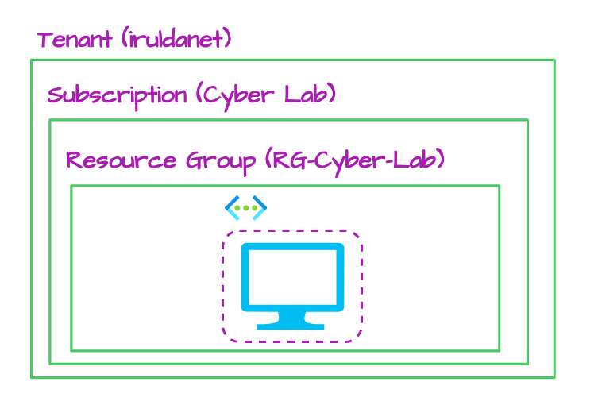
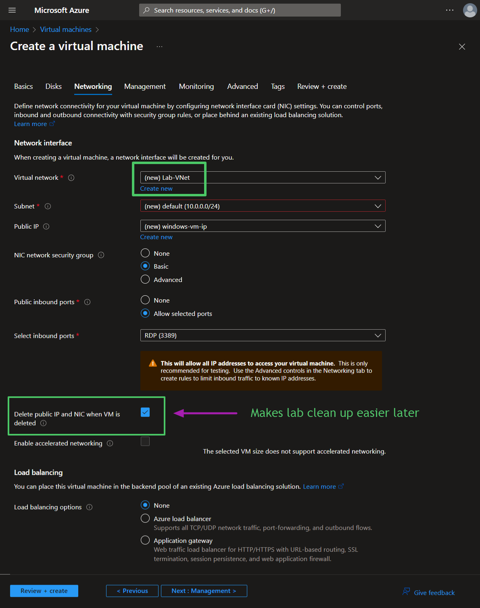
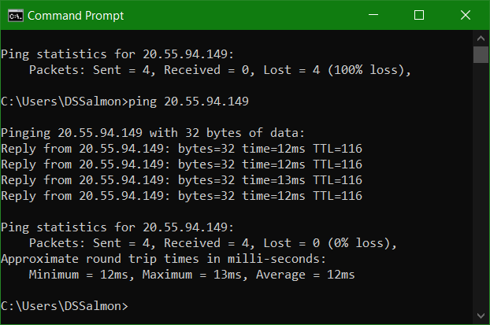
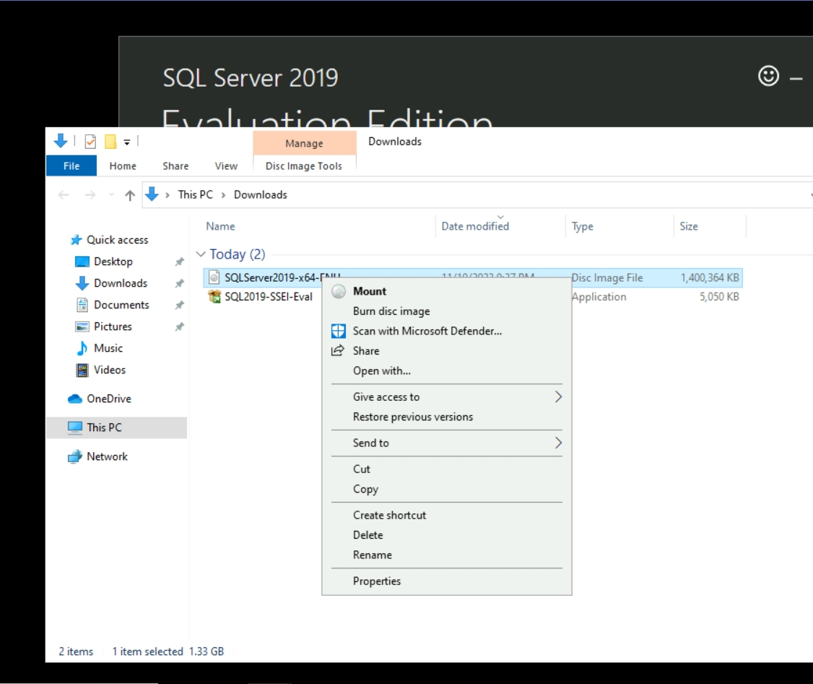
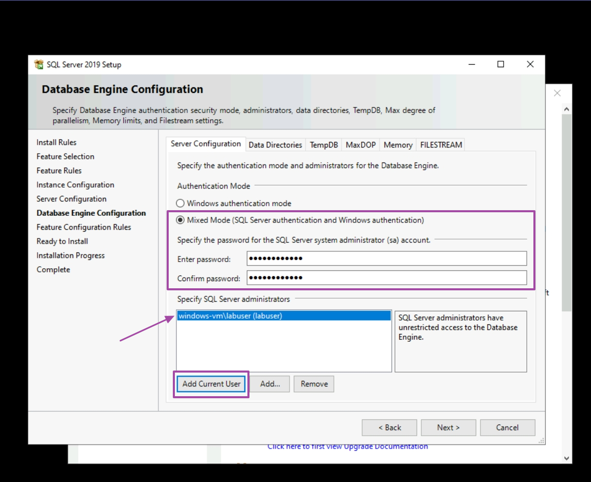
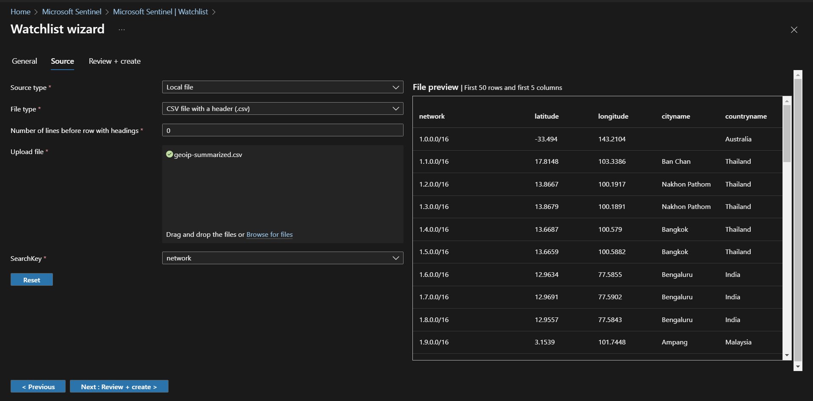
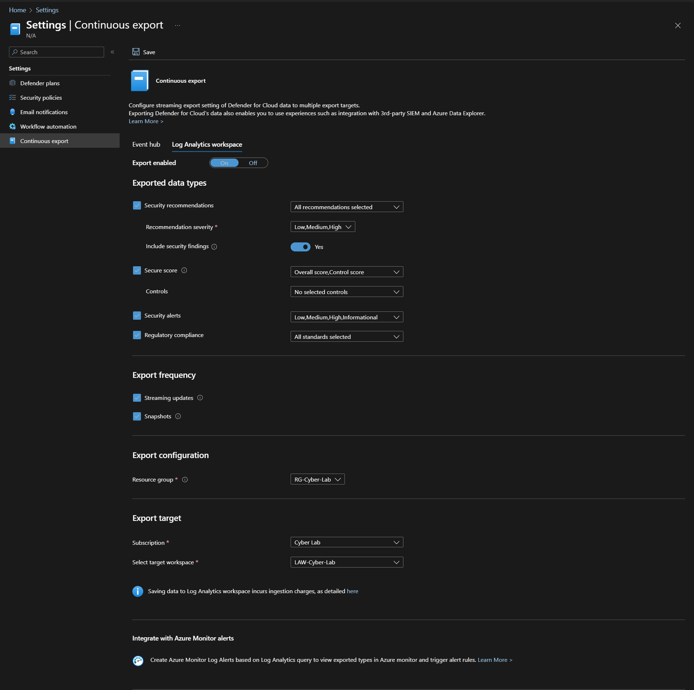

# Building a (mini) SOC & Honeynet in Azure (w/Live Traffic)


!!! note
    This is a not a necessarily complete walk-though but it is a more detailed iteration of the Github/Gitlab repo. This page is a work in progress and the documentation for this lab is egreiously long. **Click on images to expand.**

## Overview

In this project, I built a small-scale honeynet and SOC in Azure. Log Analytics was used to ingest logs from various sources that Microsoft Sentinel would leverage to build attack maps, trigger alerts, and create incidents. Microsoft Defender for Cloud was used as a data source for LAW and to assess the VM configuration relative to regulatory frameworks/security controls. I configured log collection on the insecure environment, set security metrics then observed the environment for 24 hours. After investigating the incidents that Microsoft Sentinel generated during that period, security controls were applied to address the incidents and harden the environment based on recommendations from Microsoft Defender. After a second 24-hour observation new metrics were collected on the environment post-remediation. 

Collected metrics: 

- SecurityEvent (Windows Event Logs)
- Syslog (Linux Event Logs)
- SecurityAlert (Log Analytics Alerts Triggered)
- SecurityIncident (Incidents created by Sentinel)
- AzureNetworkAnalytics_CL (Malicious Flows allowed into my honeynet)

## Architecture Before Hardening / Security Controls
<br>

The architecture of the mini honeynet in Azure consists of the following tools and components:

- Virtual Network (VNet)
- Network Security Group (NSG)
- Virtual Machines (2 Windows, 1 Linux)
- Azure Key Vault
- Azure Storage Account
- Microsoft SQL Server
- SQL Server Management Studio (SSMS)
- Azure Active Directory

Additionally, the SOC utilized the following tools, components and regulations: 

- Microsoft Sentinel (SIEM)
- Microsoft Defender for Cloud
  - [NIST SP 800-53 Revision 4](https://csrc.nist.gov/publications/detail/sp/800-53/rev-4/archive/2015-01-22)
  - [PCI DSS 3.2.1](https://listings.pcisecuritystandards.org/documents/PCI_DSS-QRG-v3_2_1.pdf) 
- Log Analytics Workspace
- Windows Event Viewer
- Kusto Query Language (KQL)
- PowerShell

To collect the metrics for the insecure environment, all resources were originally deployed, exposed to the  public internet. The Virtual Machines had their Network Security Groups open (allowing all traffic) and built-in firewalls disabled. All other resources were deployed with endpoints visible to the public Internet.

## Stage I - Building the honeynet

This project consists of two target virtual machines and one threat VM - two Windows VMs (one used for attack) and one Linux VM.

### Creating Resources

#### Create the Subscription

I already had an Azure account, a tenant (which I renamed + added a custom domain before this run) and a subscription from a previous run of the project. Here is an overview for the next few steps in this section: 

<br>

For the sake of screenshots, I'm starting at creating the subscription. Don't forget to set a budget! 

<br>

<br>

<br>

Later, I actually changed the alert threshold to something more reasonable like 90%. </br>

#### Create the first resource group

Next, create the first resource group (RG-Cyber-Lab). This one will house the resources that will be exposed to attack (the honeynet). Technically, this can be created at the same time that you create your VMs. 

<br>

#### Create Virtual Machines

Next, create two VMs. One Windows VM and one Linux VM, using mostly default settings. Add both to the **RG-Cyber-Lab** resource group. Create a new Virtual Network the honeynet (Lab-VNet). 

##### Create Windows VM 

Basics tab:

<br>

Create a new Virtual Network:

<br>

Networking tab:

 <br>


##### Create Linux VM

Create the Linux VM with the same user, region, resource group and networking settings. 

Basics tab:

 <br>

Networking tab:

 <br>

### Exposing the resources

After both VMs are deployed, change both Network Security Groups (NSGs) to allow all inbound traffic. Removing rules for RDP and SSH and replacing with the custom inbound rule. 

Windows NSG before:

 <br>

Linux NSG before:

  <br>

Custom Inbound Rule:

 <br>

Windows NSG after: 

 <br>

At this point both NSGs are identical. 

### Create Vulnerabilities

#### Disable Windows Firewall

The goal is to expose these VMs to threat actors and to make them both discoverable and reachable so that we can monitor, log and investigate incidents later. By default Windows Firewall, blocks ICMP packets from the internet. You can see that from another network the windows-vm is unreachable. 


From here, disable the firewall (wf.msc). 

**Before**


**After**


Pinging windows-vm again to test success



Connecting to the linux-vm via SSH using PuTTy


Test pinging linux-vm externally 


#### Install MS SQL Server + Utilities

Next, download and install [SQL Server Evaluation](ttps://www.microsoft.com/en-us/evalcenter/evaluate-sql-server-2019). 

Select Download Media. 


Select ISO and download location.


Once the download completes, go to download location.


Mount the ISO.



Run the installer.


Select New SQL Server


Include Database Engine Service


Select Mixed Mode, create a user and select add current user to also allow for Windows authentication using labuser. 



Once the installation completes, download and install [MS SQL Management Studio (SMSS)](https://learn.microsoft.com/en-us/sql/ssms/download-sql-server-management-studio-ssms).


Once the installation completes, restart the VM. 


##### Enable Logging on SQL Server

After restarting, follow the [Microsoft documentation](https://learn.microsoft.com/en-us/sql/relational-databases/security/auditing/write-sql-server-audit-events-to-the-security-log?view=sql-server-ver16) for adjusting settings to allow SQL Server logs to be ported to Windows Event Viewer. 

Provide full permission for the SQL Server service account (NETWORK SERVICE) to the registry hive. 


Configure the audit object access setting in Windows using auditpol by executing the provided command line statement. 


Launch SSMS and log in to the SQL Server. Then go to Properties > Security > Enable both

**Security Settings Before**


**Security Settings After**


Restart the SQL Server and try to generate some failed authentication logs by trying log into the SQL server with the wrong password. 


Check Event Viewer to make sure the logs are properly enabled and porting to Event Viewer successfully. 


It was at this time I learned a valuable lesson about **Azure Bastion**. What I had not realized is that once you deploy the bastion instance it is perpetually in a running-state. I was under the impression that once the VM was deallocated/stopped, so was the Bastion. This is not the case. To the best of my knowledge the only way to stop Bastion is to delete it. Luckily, I check cost management semi-neurotically so I caught this before I had so sell any organs. 

I also realized that I could use the Microsoft Remote Desktop on iOS (on iPad) the same way you can with macOS. I was trilled. 

#### Create Attack (Threat) VM

Create another Windows VM in a different resource group, region, and virtual network. All other settings can be the same or similar. 


#### Generate Logs 

To make sure everything is working as expected, log into the attack-vm to generate failed authentication logs on both vms.


Generating failed RDP logs on windows-vm: 


Using PowerShell to generate failed login logs on linux-vm:


Installing SMSS on attack-vm: 


Generating  failed login logs for MS SQL Server on windows-vm:

 


##### Check Logs

Using PowerShell to SSH into linux-vm: 


Investigating the logs at /var/log/auth.log for failed authentication


**Checking Event Viewer on windows-vm:**

In Windows Event Viewer, there are normally a lot of logs, in the screenshots below the logs are filtered by the specific events we're looking for. 

Windows Logs > Security, filtered by Event ID: [4625](https://learn.microsoft.com/en-us/windows/security/threat-protection/auditing/event-4625)


Windows Logs > Application, filtered by Event ID: [18456](https://learn.microsoft.com/en-us/sql/relational-databases/errors-events/mssqlserver-18456-database-engine-error?view=sql-server-ver16)


## Stage II - Building the SOC

### Log Analytics and Microsoft Sentinel (SIEM) Setup + Data Ingestion

Create Log Analytics Workspace.


Add Sentinel to the workspace. 


#### Create Sentinel Watchlist 

In Sentinel, a new watchlist for Geo IP Data. This watchlist will help us correlate security events to geographic locations later in the lab. 


Upload the geoIP data and set the search key. 



Once the watchlist begins uploading, sentinel will start ingesting the data and it will be available for query, even before ingestion completes. 


Querying GeoIP data using KQL.


Upload complete.


#### Enable Microsoft Defender for Cloud 

Open MDC: 

 

Go to Environment Settings > Drill down to the LAW > click the three dots corresponding to LAW > Edit Settings 

 

Enable Data Collection
Click Data Collection (in sidebar) > All Events > Save

 

Back in MDC, go to Environment Settings > click the three dots corresponding to the Subscription > Edit Settings 

 

Under Defender Plans, toggle **ON**: Servers, Databases, Storage and Key Vault

 

Next to Databases > Select Types > make sure 'SQL servers on Machines' is toggled **ON**, all else toggled **OFF** > Continue

 

Next to Servers > Under Monitoring Coverage,  click Settings > make sure everything is toggled **ON**

 

Next to Log Analytics Agent > under Configuration > Edit Configuration. 
Change the workspace selection to Custom and select the LAW created and configured earlier > Apply > Continue > Save


!!! note
    If you accidentally saved before configuring the LAW agent: Go back and change to custom, then go through your resources and delete resources that were automatically provisioned in the processes. To avoid future mixups, make sure there is only ONE LAW. 

Click Continuous Export in the sidebar > Select Log Analytics Workspace at the top > toggle **ON** 
Select everything (will fine tune later). 

Make sure export Export Configuration points to the resource group where the LAW is stored and Export target points to the appropriate subscription and LAW. Click Save. 




#### Configure Log Collection for Virtual Machines

Create a Storage Account for Azure to place NSG flow logs later. 

!!! note
    Storage Account name must be globally unique. 


The important part is cut off here, but make sure the storage account is in the **same region** as the target VMs.


##### Enable NSG flow logs for target VMs

Go to Network Security Groups, pick one (any but preferably one attached to a target VM) > Under Monitoring, click NSG flow logs > Create flow log

 

Click +Resource > Select the target VM's > Confirm Selection


##### Create a Data Collection Rule for target VMs


First make sure target VMs are running. The Microsoft Defender or will automatically install the agent to the VMs once they are running, if not, you can manually install later. 

Next, go to LAW > Agents > Data Collection Rules > Create Data Collection Rule 


Click + Add Resources, and select target VMs > Apply.


Click 'Next: Collect and deliver >' + Data Source and add select Linux Syslog from the dropdown for Data Source Type. Then only collect logs for LOG_AUTH (set all other logs to 'none' value) > Next: Destination


Set the destination to the Log Analytics Workspace > Add data source


Add another data source, this time for Windows logs.


Select Windows Event Logs from the data source dropdown. Under Basic > Application, Select Information. Under Security, select both Audit success and Audit failure to pull in failed authentication logs from RDP and the SQL Server. 


As you can see the options here are pretty, well, basic. In order to retrieve (filter) specific data from Windows event logs, XPath queries must be used. Switch over to Custom and add the following X-Path Queries:

For Windows Defender Malware Detection:
```Microsoft-Windows-Windows Defender/Operational!*[System[(EventID=1116 or EventID=1117)]]```

For Windows Firewall Tampering Detection:
```Microsoft-Windows-Windows Firewall With Advanced Security/Firewall!*[System[(EventID=2003)]]```


Save > Next: Destination and check that the logs are going to the appropriate LAW > Add data source > Review + Create > Create


Data Collection Rule complete and deployed


If you check back to LAW > Agents, the agents should have deployed and installed on the target VMs


<!-- Add KQL Query Here to show logs are successfully coming into MS Sentinel -->

##### Tenant Level Logging

Create diagnostic settings in Azure Active Directory (Microsoft Entra ID) that allows us to ingest logs. 

Create a user, assign global admin and use Log Analytics to check that logs are properly being ingested. 

Create an "attacker" user and generate some failed authentication logs by failing to log in 10-20 times. 

!!! note
    The AuditLogs come in pretty quickly, but the SigninLogs and AzureActivity take a while to come into the Log Analytics Workspace. Generate the logs, then take a 20-30 minute coffee break and query the LAW after. 

Audit Logs

Signin Logs

##### Subscription Level Logging

Export Azure Activity Logs to Log Analytics Workspace. 

Go to Azure Monitor > Activity Log > Export Activity Logs, create diagnostic settings. 

Generate some logs to confirm functionality. Here, I'm creating two resource groups and changing a NSG, then deleting them **after ** confirming the logs are flowing into the LAW properly. 

New Resource Groups

New inbound security rule in attacker-vm-nsg

Activity Logs 


##### Resource Level Logging (Data Plane Logs)

###### Storage Account 

Enable logs for storage account and key vault. 

Storage Accounts > Select Storage Account > Under Monitoring, select Diagnostic Settings 

Click 'Disabled' next to 'blob' > Add Diagnostic setting > Select Audit, create name for setting > Save

###### Azure Key Vault


<!---
### Configure Microsoft Sentinel
#### World Attack Maps Construction
#### Analytics, Alerting and Incident Generation
#### Attack Traffic Generation (Simulated Attacks)

### Implementing Security Controls

To collect the metrics for the secured environment, Network Security Groups were hardened by blocking ALL traffic (with the exception of my workstation), and built-in firewalls enabled. Azure Key Vault and Storage Container were protected by disabling access to public endpoints and replacing them with rivate endpoints.

### Attack Maps Before Hardening / Security 

#### NSG Allowed Malicious Inbound Flows
<br>

#### Linux SSH Authentication Failures
<br>


#### Windows RDP/SMB Authentication Failures
<br>


#### MS SQL Server Authentication Failures
<br>


### Metrics Before Hardening / Security Controls

The following table shows the measurements taken in the insecure environment for 24 hours: <br>
Start Time	2023-07-09 22:23:51 <br>
Stop Time	2023-07-10 22:23:51


| Metric                   | Count
| ------------------------ | -----
| SecurityEvents           | 131638
| Syslog                   | 4847
| SecurityAlert            | 6
| SecurityIncident         | 359
| AzureNetworkAnalytics_CL | 2450


## Stage III - Incident Response

## Stage IV - Secure Cloud Configuration

### Enabling Regulatory Compliance in MDC

## Architecture After Hardening / Security Controls
<br>


## Attack Maps After Hardening / Security Controls

```All map queries returned no results due to no instances of malicious activity for the 24-hour period after hardening.```

### NSG Allowed Malicious Inbound Flows
<br>


### Linux SSH Authentication Failures
<br>


### Windows RDP/SMB Authentication Failures
<br>


### MS SQL Server Authentication Failures
<br>


## Metrics After Hardening 

The following table shows the measurements taken after applying the security controls the environment and observing for another 24 hours: <br />
2023-07-11 22:15<br />
2023-07-12 22:15

| Metric                   | Count
| ------------------------ | -----
| SecurityEvent            | 22668
| Syslog                   | 24
| SecurityAlert            | 0
| SecurityIncident         | 0
| AzureNetworkAnalytics_CL | 0

### Impact of Security Controls 

| Metric                                       | Change post-hardening
| -------------------------------------------- | -----
| SecurityEvent (Windows VMs)                  | 82.78%
| Syslog (Linux Vms)                           | 99.50%
| SecurityAlert (Microsoft Defender for Cloud) | 100%
| SecurityIncident (Sentinel Incidents)        | 100%
| AzureNetworkAnalytics_CL                     | 100%

## Conclusion

In this project, a mini SOC honeynet was constructed in Microsoft Azure utilizing Log Analytics with Microsoft Sentinel. Sentinel used logs ingested by a Log Analytics workspace to trigger alerts and create incidents. Next, logging was enabled and data collected on the insecure environment based on established security metrics, before applying security controls. The logs and data were reassessed after implementing security measures. As a result, the number of security events and incidents were drastically reduced after the security controls were applied. 

It is worth noting that if the resources within the network were heavily utilized by regular users, it is likely that more security events and alerts may have been generated within the 24-hour period following the implementation of the security controls.


---->