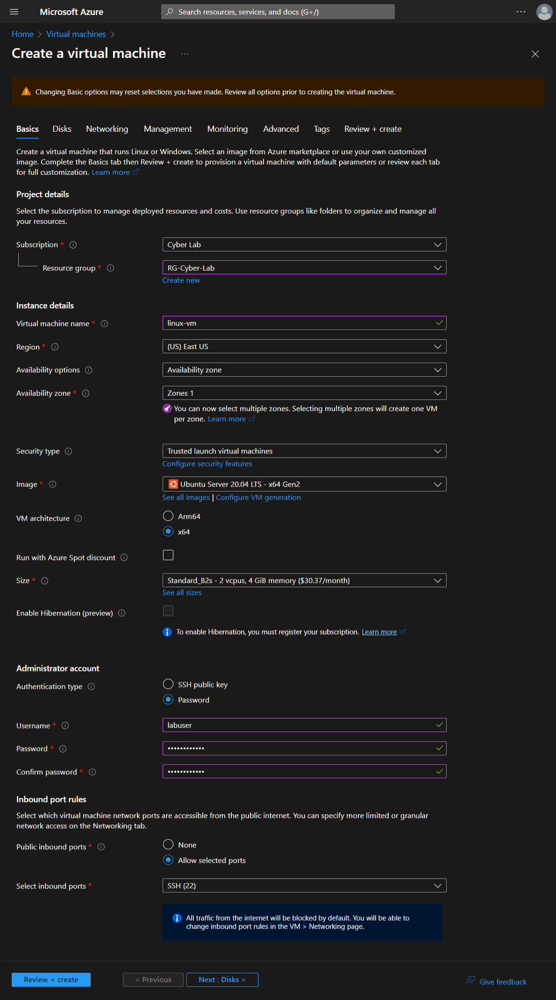
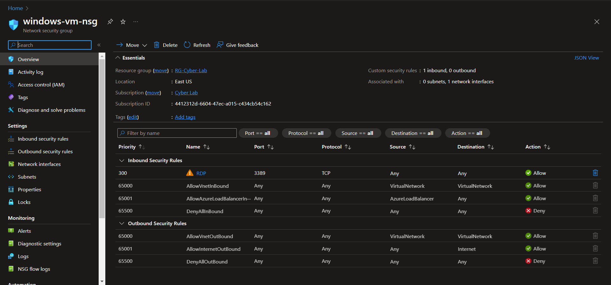
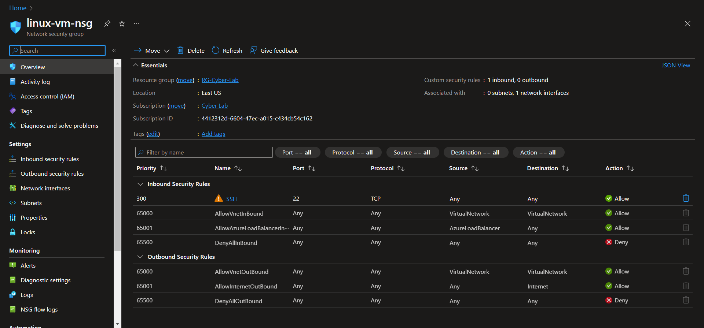
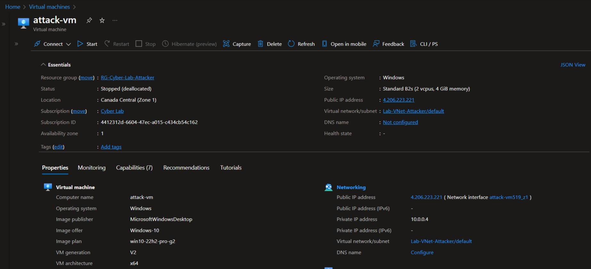

<!-- 
<figure markdown>
  { width="600" }
  <figcaption class="response" class="response">The created department resource groups.</figcaption class="response">
</figure> 
-->

!!! warning
    This page is a work in progress. 

# Building a SOC & (mini) Honeynet in Azure (w/Live Traffic)


!!! note
    This is a not a complete walk-though of the process but it is a more detailed different iteration of the Github repo. Some of the resources have already been created so, some steps will be skipped. 

## Overview

In this project, I built a small-scale honeynet in Azure. It uses Log Analytics to ingest logs from various sources that Microsoft Sentinel would leverage to build attack maps, trigger alerts, and create incidents. I configured log collection on the insecure environment, set security metrics then observed the environment for 24 hours. After investigating the incidents that Microsoft Sentinel generated during that period, security controls were applied to address the incidents and harden the environment. A second 24-hour observation was conducted to collect new data on the security metrics post-remediation. The collected metrics were:

- SecurityEvent (Windows Event Logs)
- Syslog (Linux Event Logs)
- SecurityAlert (Log Analytics Alerts Triggered)
- SecurityIncident (Incidents created by Sentinel)
- AzureNetworkAnalytics_CL (Malicious Flows allowed into my honeynet)

## Architecture Before Hardening / Security Controls
<br>

The architecture of the mini honeynet in Azure consists of the following tools and components:

- Virtual Network (VNet)
- Network Security Group (NSG)
- Virtual Machines (2 Windows, 1 Linux)
- Azure Key Vault
- Azure Storage Account
- Microsoft SQL Server
- SQL Server Management Studio (SSMS)
- Azure Active Directory
- PowerShell

Additionally, the SOC utilized the following tools, components and regulations: 

- Microsoft Sentinel (SIEM)
- Microsoft Defender for Cloud
  - [NIST SP 800-53 Revision 4](https://csrc.nist.gov/publications/detail/sp/800-53/rev-4/archive/2015-01-22)
  - [PCI DSS 3.2.1](https://listings.pcisecuritystandards.org/documents/PCI_DSS-QRG-v3_2_1.pdf) 
- Log Analytics Workspace
- Windows Event Viewer
- Kusto Query Language (KQL)

To collect the metrics for the insecure environment, all resources were originally deployed, exposed to the  public internet. The Virtual Machines had their Network Security Groups open (allowing all traffic) and built-in firewalls disabled. All other resources were deployed with endpoints visible to the public Internet.

## Stage I - Building the honeynet

This project consists of two target virtual machines and one threat VM - two Windows VMs (one used for attack) and one Linux VM.

### Creating Resources

#### Create the Subscription

I already had an Azure account, a tenant (which I renamed + added a custom domain before this run) and a subscription from a previous run of the project. Here is an overview for the next few steps in this section: 

<br>

For the sake of screenshots, I'm starting at creating the subscription. Don't forget to set a budget! 

<br>

<br>

<br>

Later, I actually changed the alert threshold to something more reasonable like 90%. </br>

#### Create the first resource group

Next, create the first resource group (RG-Cyber-Lab). This one will house the resources that will be exposed to attack (the honeynet). Technically, this can be created at the same time that you create your VMs. 

<br>

#### Create Virtual Machines

Next, create two VMs. One Windows VM and one Linux VM, using mostly default settings. Add both to the **RG-Cyber-Lab** resource group. Create a new Virtual Network the honeynet (Lab-VNet). 

##### Create Windows VM 

Basics tab:

<br>

Create a new Virtual Network:

<br>

Networking tab:

 <br>


##### Create Linux VM

Create the Linux VM with the same user, region, resource group and networking settings. 

Basics tab:

 <br>

Networking tab:

 <br>

### Exposing the resources

After both VMs are deployed, change both Network Security Groups (NSGs) to allow all inbound traffic. Removing rules for RDP and SSH and replacing with the custom inbound rule. 

Windows NSG before:

 <br>

Linux NSG before:

  <br>

Custom Inbound Rule:

 <br>

Windows NSG after: 

 <br>

At this point both NSGs are identical. 

### Create Vulnerabilities

#### Disable Windows Firewall

The goal is to expose these VMs to threat actors and to make them both discoverable and reachable so that we can monitor, log and investigate incidents later. By default Windows Firewall, blocks ICMP packets from the internet. You can see that from another network the windows-vm is unreachable. 


From here, disable the firewall (wf.msc). 

**Before**


**After**


Pinging windows-vm again to test success


Also checking out the linx-vm using PuTTy


Test pinging linux-vm externally 


#### Install MS SQL Server + Utilities

Next, download and install [SQL Server Evaluation](ttps://www.microsoft.com/en-us/evalcenter/evaluate-sql-server-2019). 

Select Download Media. 


Select ISO and download location.


Once the download completes, go to download location.


Mount the ISO.


Run the installer.


Select New SQL Server


Include Database Engine Service


Select Mixed Mode, create a user and select add current user to also allow for Windows authentication using labuser. 


Once the installation completes, download and install [MS SQL Management Studio (SMSS)](https://learn.microsoft.com/en-us/sql/ssms/download-sql-server-management-studio-ssms).


Once the installation completes, restart the VM. 


##### Enable Logging on SQL Server

After restarting, follow the [Microsoft documentation](https://learn.microsoft.com/en-us/sql/relational-databases/security/auditing/write-sql-server-audit-events-to-the-security-log?view=sql-server-ver16) for adjusting settings to allow SQL Server logs to be ported to Windows Event Viewer. 

Provide full permission for the SQL Server service account (NETWORK SERVICE) to the registry hive. 


Configure the audit object access setting in Windows using auditpol by executing the provided command line statement. 


Launch SSMS and log in to the SQL Server. Then go to Properties > Security > Enable both

**Security Settings Before**


**Security Settings After**


Restart the SQL Server and try to generate some failed authentication logs by trying log into the SQL server with the wrong password. 


Check Event Viewer to make sure the logs are properly enabled and porting to Event Viewer successfully. 


It was at this time I learned a valuable lesson about Azure Bastion. I was under the impression that the cost was per-use - what I had not realized is that once you deploy Azure Bastion it is perpetually in a running-state. I thought that once the VM was deallocated/stopped, so was the Bastion. This is not the case. To the best of my knowledge the only way to stop Bastion is to delete it. Luckily, I check cost management semi-neurotically so I caught this before I had so sell any organs. 

I also realized that I could use the Microsoft Remote Desktop on iOS (on iPad) the same way you can with macOS. I was trilled. 

#### Create Attack (Threat) VM

Create another Windows VM in a different resource group, region, and virtual network. All other settings can be the same or similar. 




## Stage II - Building the SOC

### Log Analytics and Microsoft Sentinel (SIEM) Setup + Data Ingestion

Create Log Analytics Workspace and add Microsoft Sentinel to the workspace.

<!--
#### Enable Microsoft Defender for Cloud 
#### Configure Log Collection for Virtual Machines
##### Tenant Level Logging
##### Subscription Level Logging
##### Resource Level Logging

### Configure Microsoft Sentinel
#### World Attack Maps Construction
#### Analytics, Alerting and Incident Generation
#### Attack Traffic Generation (Simulated Attacks)

### Implementing Security Controls

To collect the metrics for the secured environment, Network Security Groups were hardened by blocking ALL traffic (with the exception of my workstation), and built-in firewalls enabled. Azure Key Vault and Storage Container were protected by disabling access to public endpoints and replacing them with rivate endpoints.

### Attack Maps Before Hardening / Security 

#### NSG Allowed Malicious Inbound Flows
<br>

#### Linux SSH Authentication Failures
<br>


#### Windows RDP/SMB Authentication Failures
<br>


#### MS SQL Server Authentication Failures
<br>


### Metrics Before Hardening / Security Controls

The following table shows the measurements taken in the insecure environment for 24 hours: <br>
Start Time	2023-07-09 22:23:51 <br>
Stop Time	2023-07-10 22:23:51


| Metric                   | Count
| ------------------------ | -----
| SecurityEvents           | 131638
| Syslog                   | 4847
| SecurityAlert            | 6
| SecurityIncident         | 359
| AzureNetworkAnalytics_CL | 2450


## Stage III - Incident Response

## Stage IV - Secure Cloud Configuration

### Enabling Regulatory Compliance in MDC

## Architecture After Hardening / Security Controls
<br>


## Attack Maps After Hardening / Security Controls

```All map queries returned no results due to no instances of malicious activity for the 24-hour period after hardening.```

### NSG Allowed Malicious Inbound Flows
<br>


### Linux SSH Authentication Failures
<br>


### Windows RDP/SMB Authentication Failures
<br>


### MS SQL Server Authentication Failures
<br>


## Metrics After Hardening 

The following table shows the measurements taken after applying the security controls the environment and observing for another 24 hours: <br />
2023-07-11 22:15<br />
2023-07-12 22:15

| Metric                   | Count
| ------------------------ | -----
| SecurityEvent            | 22668
| Syslog                   | 24
| SecurityAlert            | 0
| SecurityIncident         | 0
| AzureNetworkAnalytics_CL | 0

### Impact of Security Controls 

| Metric                                       | Change post-hardening
| -------------------------------------------- | -----
| SecurityEvent (Windows VMs)                  | 82.78%
| Syslog (Linux Vms)                           | 99.50%
| SecurityAlert (Microsoft Defender for Cloud) | 100%
| SecurityIncident (Sentinel Incidents)        | 100%
| AzureNetworkAnalytics_CL                     | 100%

## Conclusion

In this project, a mini honeynet was constructed in Microsoft Azure utilizing Log Analytics with Microsoft Sentinel. Sentinel used logs ingested by a Log Analytics workspace to trigger alerts and create incidents. Next, logging was enabled and data collected on the insecure environment based on established security metrics, before applying security controls. The logs and data were reassessed after implementing security measures. As a result, the number of security events and incidents were drastically reduced after the security controls were applied. 

It is worth noting that if the resources within the network were heavily utilized by regular users, it is likely that more security events and alerts may have been generated within the 24-hour period following the implementation of the security controls.


---->