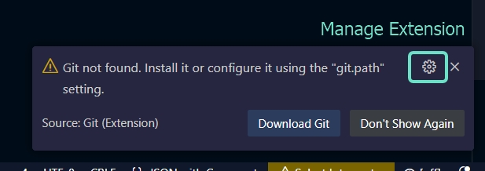
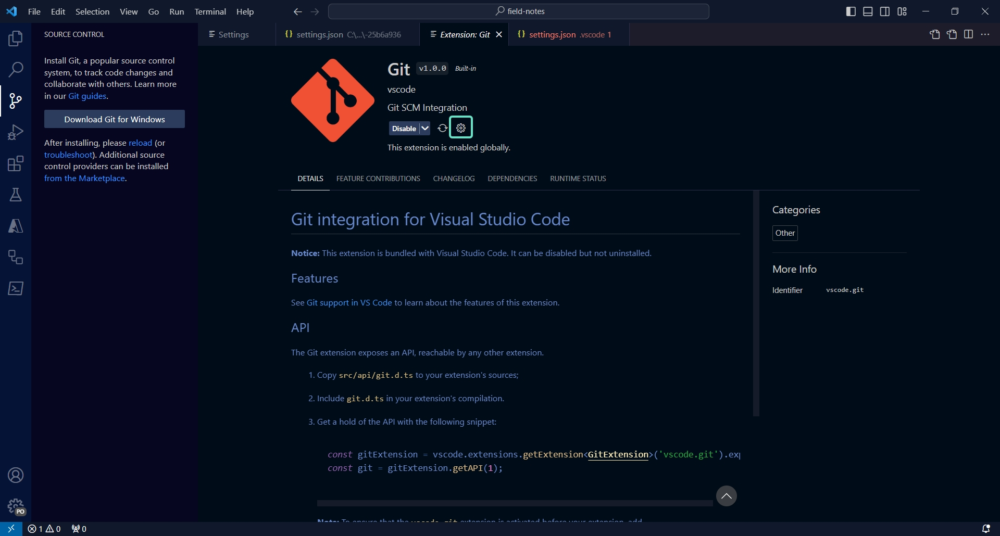
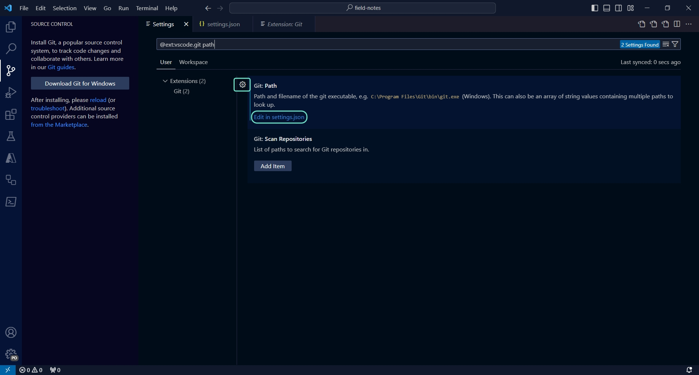
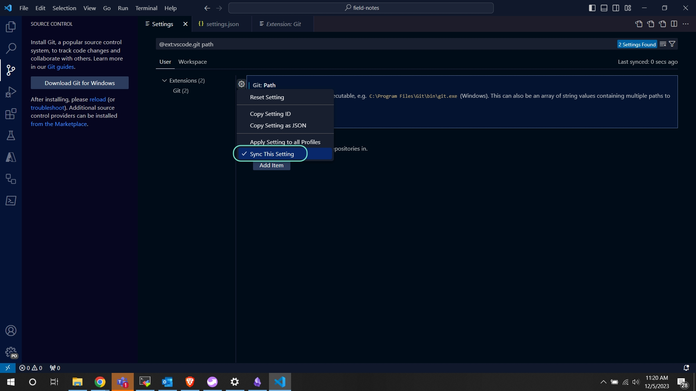
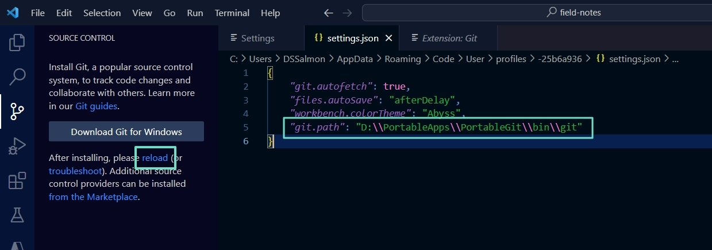

# Using PortableGit with VSCode Portable

I changed devices and ended up having to do this again. Since I completely forgot how and failed to document this the last time, here are the field notes. 

File > Preferences > Profiles > Portable

Sync Setting to Portable Profile - hopefully this means you won't have to do this again.... then click "Edit in settings.json" to open the settings page for this profile. 

Add the path to the git binary, save and reload the extension. 

You should be all good now. 

!!! note
    You will not be able to use git in the integrated terminal but you should still be able to use the Git extension. 

Reference: 
[visual studio code - Use portable VSCode with portable Git - Stack Overflow](https://stackoverflow.com/questions/71515762/use-portable-vscode-with-portable-git)
