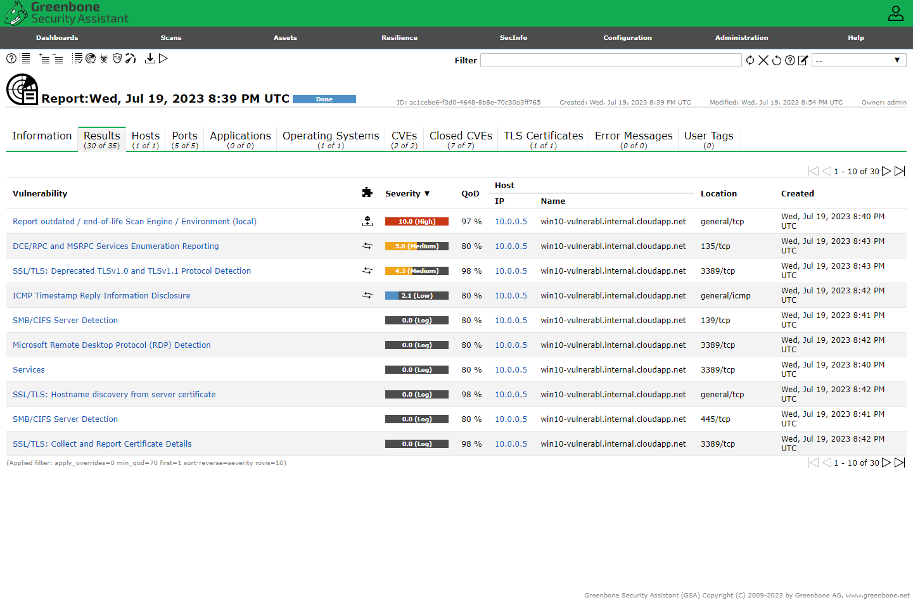
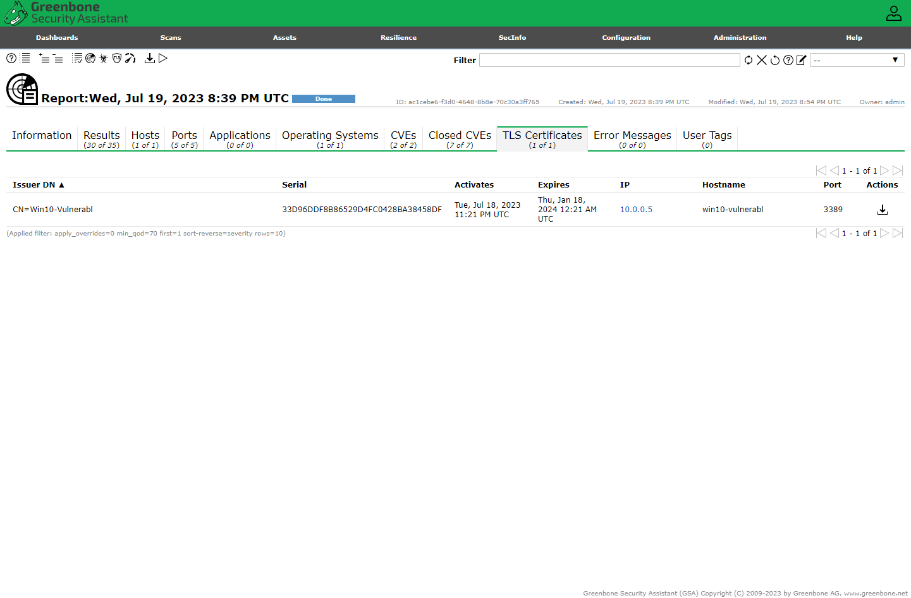

---
tags:
- openVAS
- vulnerability-management
- azure
---

# Vulnerability Management with Greenbone OpenVAS

## Objectives
1. [Prepare Vulnerability Management Scanner](#Part-1)
2. [Create Client Virtual Machine and Make it Vulnerable](#Part-2)
3. [Perform Unauthenticated Scan](#Part-3)
4. [Make Configurations for Authenticated Scans (VM)](#Part-4)
5. [Make Configurations for Authenticated Scans (OpenVAS)](#Part-5)
6. [Perform Authenticated Scan against our Vulnerable Windows VM](#Part-6)
7. [Remediate Vulnerabilities](#Part-7)
8. [Verify Remediation](#Part-8)
   
!!! info

    The goal of the lab is to configure and explore the platform, not to practice remediation. I will perform some minor vulnerability remediation, but only to test how the scans change in response.

### <a name="Part-1">Prepare Vulnerability Management Scanner</a>

From the [Azure Portal](https://portal.azure.com) → Go to the Marketplace → “OpenVAS secured and supported by HOSSTED” and proceeded to create a "Vulnerability-Management" resource group and VM.

<figure markdown>
  { width="700" }
  <figcaption>Selecting OpenVAS from the Azure Marketplace</figcaption>
</figure>

<figure markdown>
  { width="700" }
  <figcaption>Creating the OpenVAS VM in Azure</figcaption>
</figure>

<figure markdown>
  { width="700" }
  <figcaption>OpenVAS VM Overview</figcaption>
</figure>

After the VM was created, I used PuTTy to SSH into it and waited for the initial configuration to complete. 

<figure markdown>
  { width="700" }
  <figcaption>OpenVAS connection via PuTTy</figcaption>
</figure>

### <a name="Part-2">Create a Vulnerable Client </a>
Back in the [Azure Portal](https://portal.azure.com/) → Virtual Machines → Create
In the same resource group and the same Vnet as OpenVAS.

<figure markdown>
  { width="700" }
  <figcaption>Vulnerable client VM in Azure</figcaption>
</figure>

After the VM was created, I RDP'd into the machine to make it vulnerable by disabling the firewall and installing the following very old versions of software (with known vulnerabilities):  
   - FireFox: Firefox Setup 97.0b5  
   - VLC Player: vlc-1.1.7-win32  
   - Adobe Reader: 10.0_AdbeRdr1000_en_US_1_  

<figure markdown>
  { width="700" }
  <figcaption>Disabled Firewall in Windows 10 VM</figcaption>
</figure>

<figure markdown>
  { width="700" }
  <figcaption>Installing insecure software on Windows 10 VM</figcaption>
</figure>

### <a name="Part-3">Configure OpenVAS to Perform Unauthenticated Scan </a>

Login to OpenVAS with the URL and credentials provided during initial config  → Assets → Hosts → New Host

<figure markdown>
  { width="600" }
  <figcaption>Login to OpenVAS</figcaption>
</figure>

<figure markdown>
  { width="700" }
  <figcaption>Private IP of client VM</figcaption>
</figure>

<figure markdown>
  { width="700" }
  <figcaption>Created a new host by adding client VM private IP Address</figcaption>
</figure>

<figure markdown>
  { width="700" }
  <figcaption>Host in Greenbone</figcaption>
</figure>
Created a New Target from the Host, name it “Azure Vulnerable VM”.

<figure markdown>
  { width="700" }
  <figcaption>Creating a new target</figcaption>
</figure>

Created a new Task - “Scan - Azure Vulnerable VMs”

<figure markdown>
  { width="700" }
  <figcaption>New Task</figcaption>
</figure>

Initiated the first scan of the Windows 10 VM client

<figure markdown>
  { width="700" }
  <figcaption>Scan Completed</figcaption>
</figure>

#### Scan Results

!!! note
    Since this scan is not credentialed, the results are not an in-depth scan. 

<figure markdown>
  { width="700" }
  <figcaption>General scan results</figcaption>
</figure>

<figure markdown>
  { width="700" }
  <figcaption>Port scan results</figcaption>
</figure>

<figure markdown>
  { width="700" }
  <figcaption>Found CVEs</figcaption>
</figure>

<figure markdown>
  { width="700" }
  <figcaption>Found Closed CVEs</figcaption>
</figure>

<figure markdown>
  { width="700" }
  <figcaption>TLS scan results</figcaption>
</figure>

### <a name="Part-4">Make Configurations for Credentialed Scans (Within VM) </a>

Making some changes to the Windows 10 client to allow OpenVAS to preform a more in-depth authenticated/credentialed scan. 

Disabled User Account Control

<figure markdown>
  { width="700" }
  <figcaption>Disable UAC</figcaption>
</figure>

Made the following registry changes:  
- Enabled Remote Registry (services.msc)  
- Launching Registry Editor (regedit.exe - as Admin)  
- Navigated to: HKEY_LOCAL_MACHINE\SOFTWARE\Microsoft\Windows\CurrentVersion\Policies\System  
- Set the registry key by creating a new DWORD (32-bit) value with the following properties:  
   &emsp; Name: LocalAccountTokenFilterPolicy  Value: 1

<figure markdown>
  { width="550" }
   <figcaption>Enable Remote Registry</figcaption>
</figure>

<figure markdown>
  { width="500" }
     <figcaption>Creating new DWORD</figcaption>
</figure>

<figure markdown>
  { width="700" }
     <figcaption>Setting the Registry Key</figcaption>
</figure>

### <a name="Part-5">Make Configurations for Credentialed Scans (OpenVAS) </a>

Created a new credential under, Configuration → Credentials → New Credential → Added username & password for Windows 10 VM client under "Azure VM Credentials"

<figure markdown>
  { width="400" }
</figure>

Created a new target, and attached the new credentials  

<figure markdown>
  { width="700" }
  <figcaption>Add credentials to new target</figcaption>
</figure>

### <a name="Part-6">Execute Credentialed Scan against our Vulnerable Windows VM </a>

In OpenVAS, Scans → Tasks

To create the credentialed scan, I cloned the “Scan - Azure Vulnerable VMs” Task, then changed to update the scan name and target. 

<figure markdown>
  { width="700" }
  <figcaption>Creating credentialed scan</figcaption>
</figure>

Initialized the credentialed scan and reviewed the results.

#### Credentialed Scan Results

Now we can get 
<figure markdown>
  { width="700" }
  <figcaption>Creating credentialed scan</figcaption>
</figure>

The SMB results show that OpenVAS was able to authenticate successfully. 

<figure markdown>
  { width="700" }
  <figcaption>Successful SMB authentication</figcaption>
</figure>

<figure markdown>
  { width="700" }
  <figcaption>Credentialed scan - ports results</figcaption>
</figure>

<figure markdown>
  { width="700" }
  <figcaption>Credentialed scan - CVEs</figcaption>
</figure>

<figure markdown>
  { width="700" }
  <figcaption>Credentialed scan - closed CVE results</figcaption>
</figure>

<figure markdown>
  { width="700" }
  <figcaption>Credentialed scan - applications results</figcaption>
</figure>

### <a name="Part-7">Remediate Vulnerabilities </a>

In the Win10-Vulnerable VMm, I uninstalled Adobe Reader, VLC Player, and Firefox. I initially intended to update but some of the versions were too old and it was simpler to uninstall rather than download new versions and reinstall everything since we don't actually need to use anything. 

I also tried enabling the firewall, but it affected OpenVAS' ability to perform the scan. I was concerned that reverting the UAC would do the same. Instead, I changed the NSG from allowing any inbound RDP connections, to only allowing connections from my IP. In the Win10-Vulnerable VMm, I applied all available updates. 

<figure markdown>
  { width="700" }
  <figcaption>Windows 10 VM client NSG before</figcaption>
</figure>

<figure markdown>
  { width="700" }
  <figcaption>Windows 10 VM client NSG after</figcaption>
</figure>

<figure markdown>
  { width="700" }
  <figcaption>Completed Windows Update</figcaption>
</figure>

### <a name="Part-8">Verify Remediation </a>

Re-initiated the “Credentialed Scan - Azure Vulnerable VMs ” task and observed the results.

<figure markdown>
  { width="700" }
  <figcaption>Post Remediation Results page</figcaption>
</figure>

### Reflection

While the most critical vulnerabilities appear to have been mitigated, it's interesting how little effect applying system updates changed the scan. Although I restarted the VM a few times during and after the update process, I wonder if timing is a factor (should I have waited an hour or so before running the scan again?) . I would be very interested in completing this lab again, but also using Nessus to compare the scan results from both platforms. 

!!! tip
    Click to zoom on any images. 

