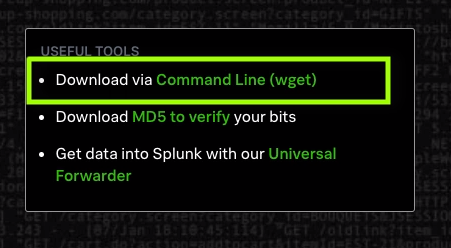
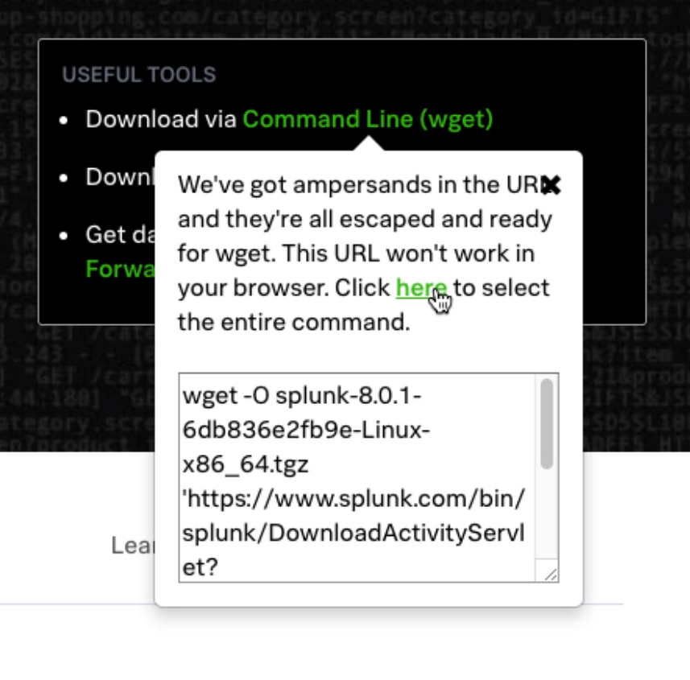

# Download and Install Splunk Linux

For my Splunk labs I'm using Ubuntu on VirtualBox. 

You can download Splunk from the website. For Ubuntu, you can download the debian package. For RedHat or CentOS, you may want to use the .rpm package. As it begins to download, cancel. A box will appear with the link to download via the command line.

On Ubuntu this will download the tarball. Move the tarball to the `/opt` folder:

`sudo mv <splunk tarball file>.tgz /opt`

